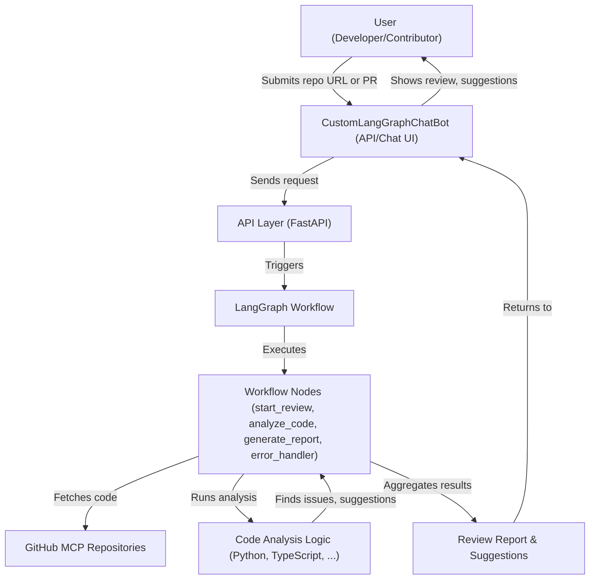
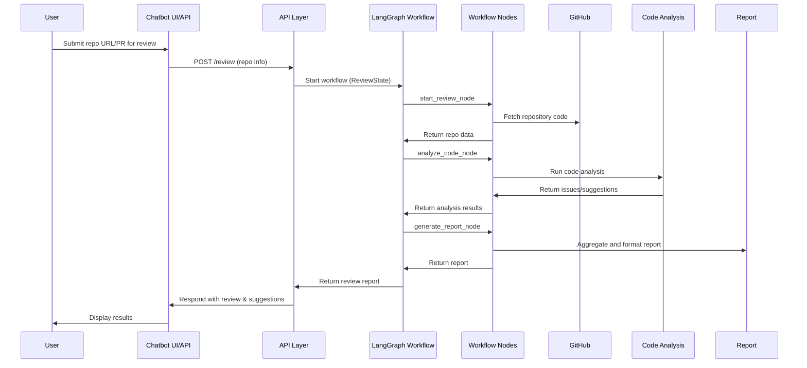

# Architecture: CustomLangGraphChatBot

This document describes the architecture of the custom chatbot for reviewing MCP GitHub repositories, providing code review and suggestions.

## Overview
The system is designed to automate code review for GitHub repositories using a modular, extensible workflow powered by LangGraph. It analyzes code, generates actionable feedback, and can be integrated with chat or web interfaces.

## Architecture Diagram



## Sequence Diagram: Review Request Flow



## Data Structures

### ReviewState (state.py)
```python
class ReviewState(TypedDict):
    messages: List[BaseMessage]
    repository_url: str
    analysis_results: Optional[Dict[str, Any]]
    current_step: str
    error_message: Optional[str]
```
- **messages**: Conversation or workflow messages.
- **repository_url**: URL of the GitHub repo under review.
- **analysis_results**: Output from code analysis (issues, metrics, etc.).
- **current_step**: Current node in the workflow.
- **error_message**: Error details, if any.

### Review Report (example)
```json
{
  "repository_url": "https://github.com/org/repo",
  "issues": [
    {
      "file_path": "src/app.py",
      "line_number": 42,
      "severity": "high",
      "category": "bug",
      "message": "Possible null dereference.",
      "suggestion": "Add a null check before usage."
    }
  ],
  "overall_score": 8.5,
  "summary": "Good code quality with minor issues.",
  "recommendations": ["Add more tests.", "Refactor complex functions."]
}
```

## Error Handling
- Each node returns an `error_message` in the state if an error occurs.
- The workflow checks for errors and routes to `error_handler_node` if needed.
- The error handler can:
  - Log errors
  - Attempt recovery (e.g., retry, fallback)
  - Return partial results or user-friendly messages

## Extension Points
- **Add new languages**: Implement new analysis modules (e.g., `analyze_typescript_code`) and update `analyze_code_node` to dispatch based on file type.
- **Add workflow steps**: Create new node functions and add them to the workflow in `workflow.py`.
- **Integrate with other tools**: Add nodes for notifications, CI/CD, or external APIs.
- **API expansion**: Add endpoints for new features (e.g., batch review, webhook triggers).

## Security & Privacy
- Store and handle GitHub tokens securely (use environment variables or secrets management).
- Validate and sanitize all user input.
- Limit access to private repositories based on user permissions.
- Log sensitive actions for auditability.

## Development Tips
- Use the provided `ROADMAP.md` for prioritized tasks.
- Write tests for new nodes and analysis logic.
- Document new features and update this architecture file as the system evolves.

---

*For more details, see the codebase and README.md.* 