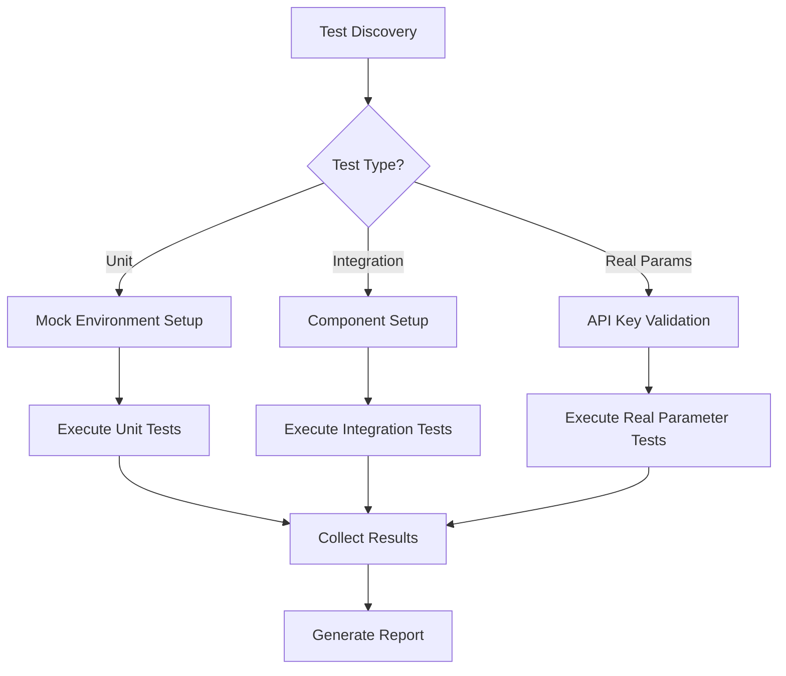
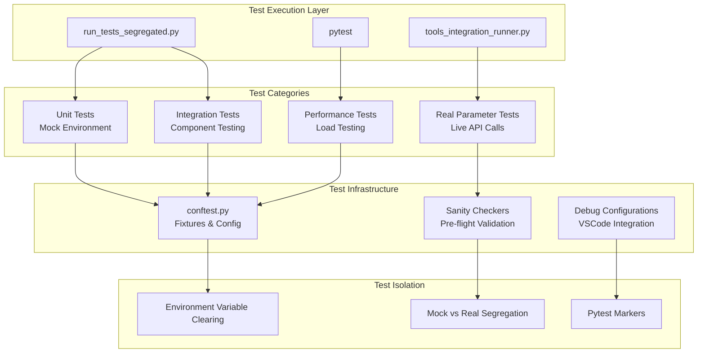
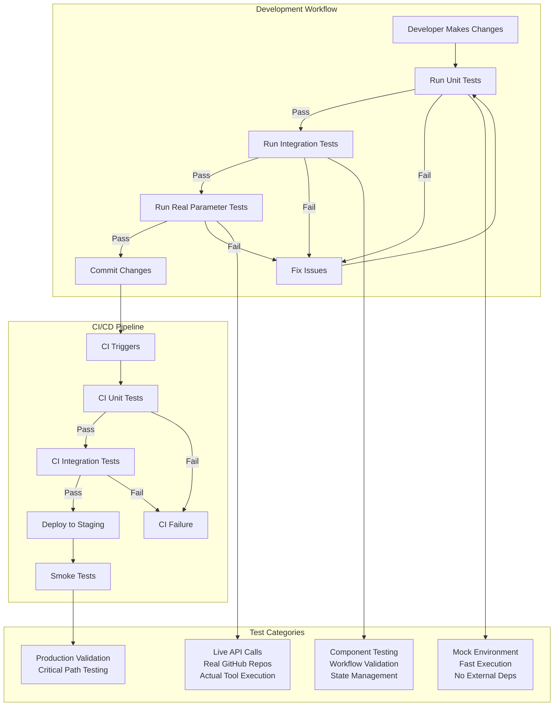
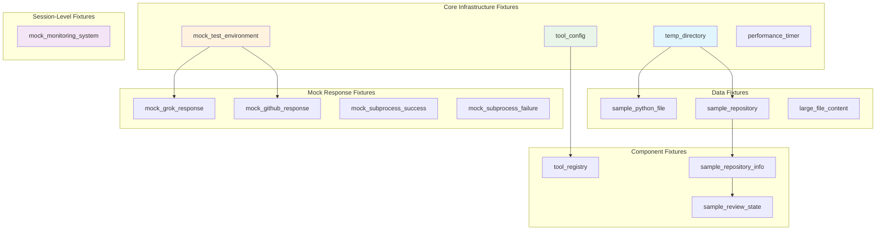
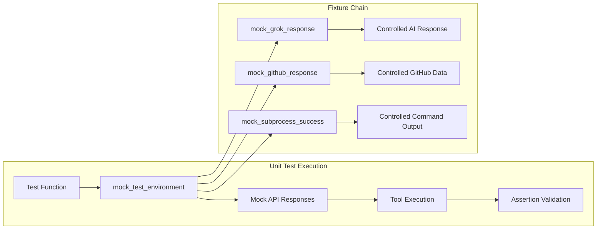
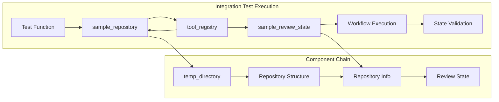
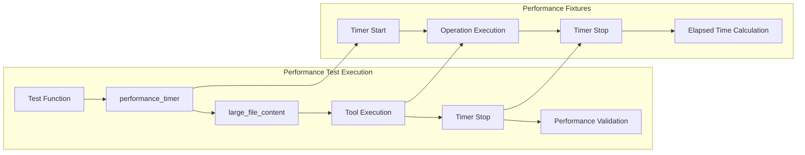
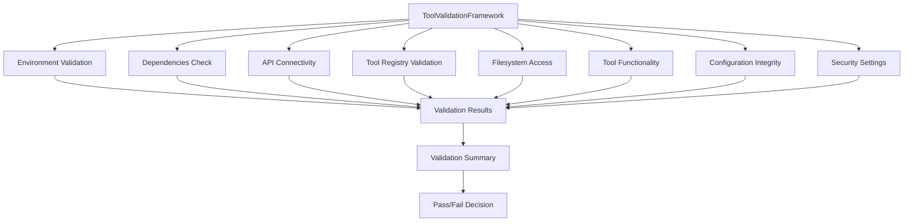

# Testing Architecture Documentation

## Overview

This document provides a comprehensive guide to the testing framework architecture for the CustomLangGraphChatBot project. The testing system is designed with multiple layers of validation, real parameter testing capabilities, and comprehensive coverage across all components.

## Table of Contents

1. [Test Framework Structure](#test-framework-structure)
2. [Test Categories and Markers](#test-categories-and-markers)
3. [Test Execution Flow](#test-execution-flow)
4. [Real Parameter Testing System](#real-parameter-testing-system)
5. [Test Segregation and Isolation](#test-segregation-and-isolation)
6. [Debugging and Development Tools](#debugging-and-development-tools)
7. [Adding New Tests](#adding-new-tests)
8. [CI/CD Integration](#cicd-integration)

## Test Framework Structure

### Directory Layout
```
tests/
├── conftest.py                    # Shared fixtures and configuration
├── test_*.py                     # Individual test modules
├── integration/                  # Integration test utilities
└── fixtures/                     # Test data and mock files

scripts/
├── run_tests_segregated.py      # Test execution controller
├── tools_integration_runner.py  # Real parameter test runner
└── demo_*.py                    # Demo and validation scripts

.vscode/
└── launch.json                  # Debug configurations
```

### Core Test Files

#### Unit Tests
- `test_ai_analysis_tools.py` - AI-powered analysis tools
- `test_static_analysis_tools.py` - Static code analysis tools  
- `test_github_tools.py` - GitHub integration tools
- `test_notification_tools.py` - Notification system tools
- `test_utility_tools.py` - Utility and helper tools
- `test_workflow_integration.py` - Workflow node testing

#### Integration Tests
- `test_api_integration.py` - API endpoint integration
- `test_tools_integration.py` - Cross-tool integration
- `test_error_handling.py` - Error scenarios and edge cases

#### API Tests
- `test_api_basic.py` - Basic API functionality
- `test_api_fixed.py` - API response validation

## Test Categories and Markers

### Pytest Markers
```python
# Unit tests with mocked dependencies
@pytest.mark.unit
@pytest.mark.mock_env

# Integration tests with real components
@pytest.mark.integration

# Real parameter tests with actual API calls
@pytest.mark.real_params

# Performance and load tests
@pytest.mark.performance
```

### Test Environment Types

1. **Mock Environment (`mock_env`)**
   - Uses mocked external dependencies
   - Fast execution
   - No external API calls
   - Suitable for CI/CD pipelines

2. **Real Parameter Environment (`real_params`)**
   - Uses actual API endpoints
   - Requires valid API keys
   - Tests real-world scenarios
   - Slower execution

3. **Integration Environment (`integration`)**
   - Tests component interactions
   - May use mix of real and mocked dependencies
   - Validates workflow execution

## Test Execution Flow

### 1. Test Discovery and Segregation

The `run_tests_segregated.py` script provides multiple execution modes:

```bash
# Run only unit tests with mocks
python scripts/run_tests_segregated.py --unit-only

# Run only integration tests
python scripts/run_tests_segregated.py --integration-only

# Run only real parameter tests
python scripts/run_tests_segregated.py --real-params-only

# Run all tests
python scripts/run_tests_segregated.py --all
```

### 2. Test Isolation Mechanisms

#### Environment Variable Isolation
```python
# Clear environment variables for test isolation
with patch.dict(os.environ, {var: '' for var in env_vars_to_clear}, clear=False):
    # Test execution
```

#### Mock vs Real Parameter Segregation
- Tests are marked with specific pytest markers
- Execution scripts filter tests based on markers
- Prevents interference between mock and real tests

### 3. Test Execution Pipeline



### 4. Testing Framework Architecture Overview



## Real Parameter Testing System

### Complete Test Flow Architecture



### Architecture Components

#### 1. Sanity Checkers (`sanity_checkers/`)
- Validate API connectivity
- Check authentication
- Verify tool configurations
- Pre-flight validation

#### 2. Integration Runners
- `tools_integration_runner.py` - Orchestrates real parameter tests
- Manages test execution flow
- Handles API rate limiting
- Collects comprehensive results

#### 3. Environment Configuration
```python
# Required environment variables for real parameter tests
GITHUB_TOKEN=your_github_token
OPENAI_API_KEY=your_openai_key
SLACK_WEBHOOK_URL=your_slack_webhook
EMAIL_PASSWORD=your_email_password
```

### Real Parameter Test Flow

1. **Pre-flight Validation**
   - Check API key availability
   - Validate network connectivity
   - Verify tool configurations

2. **Tool Category Testing**
   - GitHub Tools
   - AI Analysis Tools
   - Static Analysis Tools
   - Notification Tools
   - Utility Tools

3. **Result Aggregation**
   - Success/failure tracking
   - Performance metrics
   - Error categorization

## Test Segregation and Isolation

### Problem Solved
The testing framework addresses the critical issue of test interference between:
- Mock tests (fast, isolated)
- Real parameter tests (slow, external dependencies)
- Integration tests (component interactions)

### Solution Implementation

#### 1. Marker-Based Segregation
```python
# pytest.ini configuration
markers =
    unit: Unit tests with mocked dependencies
    integration: Integration tests
    real_params: Tests using real API parameters
    mock_env: Tests using mocked environment
    performance: Performance and load tests
```

#### 2. Execution Scripts
- `--unit-only`: Runs only unit tests with mocks
- `--integration-only`: Runs integration tests
- `--real-params-only`: Runs real parameter tests
- `--all`: Runs complete test suite

#### 3. Environment Isolation
```python
# Example of environment variable clearing
env_vars_to_clear = [
    'GITHUB_TOKEN', 'OPENAI_API_KEY', 'SLACK_WEBHOOK_URL'
]
with patch.dict(os.environ, {var: '' for var in env_vars_to_clear}, clear=False):
    # Test execution with clean environment
```

## Debugging and Development Tools

### VSCode Debug Configurations

The `.vscode/launch.json` provides debug configurations for:

#### Individual Tool Testing
```json
{
    "name": "Debug GitHub Tools",
    "type": "python",
    "request": "launch",
    "program": "${workspaceFolder}/scripts/tools_integration_runner.py",
    "args": ["--category", "github"]
}
```

#### Test File Debugging
```json
{
    "name": "Debug Specific Test File",
    "type": "python",
    "request": "launch",
    "module": "pytest",
    "args": ["${input:testFile}", "-v", "-s"]
}
```

#### Integration Runner Debugging
```json
{
    "name": "Debug Integration Runner",
    "type": "python",
    "request": "launch",
    "program": "${workspaceFolder}/scripts/tools_integration_runner.py"
}
```

### Input Variables for Dynamic Debugging
```json
"inputs": [
    {
        "id": "testFile",
        "description": "Test file to debug",
        "default": "tests/test_github_tools.py",
        "type": "promptString"
    }
]
```

## Adding New Tests

### 1. Unit Test Template
```python
import pytest
from unittest.mock import Mock, patch
from tools.your_tool import YourTool

@pytest.mark.unit
@pytest.mark.mock_env
class TestYourTool:
    def setup_method(self):
        self.tool = YourTool()
    
    def test_basic_functionality(self):
        # Mock external dependencies
        with patch('external.dependency') as mock_dep:
            mock_dep.return_value = "expected_result"
            
            result = self.tool.execute("test_input")
            
            assert result["success"] is True
            assert "expected_data" in result
```

### 2. Real Parameter Test Template
```python
@pytest.mark.real_params
@pytest.mark.skipif(not os.getenv('API_KEY'), reason="API key required")
class TestYourToolRealParams:
    def test_real_api_call(self):
        tool = YourTool()
        
        # Use real parameters
        result = tool.execute("https://github.com/real/repo")
        
        assert result["success"] is True
        assert "real_data" in result
```

### 3. Integration Test Template
```python
@pytest.mark.integration
class TestYourToolIntegration:
    def test_workflow_integration(self):
        # Test tool within workflow context
        workflow = create_test_workflow()
        result = workflow.execute_with_tool(YourTool())
        
        assert result["workflow_success"] is True
```

### 4. Adding to Test Categories

#### Update `tools_integration_runner.py`
```python
TOOL_CATEGORIES = {
    'your_category': [
        'YourTool1',
        'YourTool2'
    ]
}
```

#### Update Test Markers
```python
# In your test file
pytestmark = [
    pytest.mark.unit,
    pytest.mark.your_category  # Add category marker
]
```

## CI/CD Integration

### GitHub Actions Workflow

The `.github/workflows/tests.yml` integrates with this testing architecture:

```yaml
name: Tests
on: [push, pull_request]

jobs:
  unit-tests:
    runs-on: ubuntu-latest
    steps:
      - uses: actions/checkout@v3
      - name: Setup Python
        uses: actions/setup-python@v4
        with:
          python-version: '3.12'
      - name: Install dependencies
        run: pip install -r requirements.txt
      - name: Run unit tests
        run: python scripts/run_tests_segregated.py --unit-only

  integration-tests:
    runs-on: ubuntu-latest
    needs: unit-tests
    steps:
      - uses: actions/checkout@v3
      - name: Setup Python
        uses: actions/setup-python@v4
        with:
          python-version: '3.12'
      - name: Install dependencies
        run: pip install -r requirements.txt
      - name: Run integration tests
        run: python scripts/run_tests_segregated.py --integration-only
```

### Test Execution Strategy

1. **Fast Feedback Loop**
   - Unit tests run first (fast, reliable)
   - Integration tests run after unit tests pass
   - Real parameter tests run in separate workflow (optional)

2. **Environment-Specific Testing**
   - Development: All test types
   - CI/CD: Unit and integration only
   - Staging: Include real parameter tests
   - Production: Smoke tests only

## Best Practices for Contributors

### 1. Test Naming Conventions
- `test_<functionality>_<scenario>.py` for test files
- `test_<method>_<condition>` for test methods
- Use descriptive names that explain the test purpose

### 2. Test Organization
- Group related tests in classes
- Use setup/teardown methods for common initialization
- Keep tests focused and atomic

### 3. Mock Strategy
- Mock external dependencies at the boundary
- Use real objects for internal components
- Prefer dependency injection for testability

### 4. Real Parameter Tests
- Always check for required environment variables
- Use `@pytest.mark.skipif` for conditional execution
- Include cleanup for any created resources

### 5. Documentation
- Document complex test scenarios
- Include examples of expected behavior
- Explain any special setup requirements

## Troubleshooting Common Issues

### 1. Test Interference
**Problem**: Tests pass individually but fail when run together
**Solution**: Use proper test isolation with environment variable clearing

### 2. Mock Not Working
**Problem**: Mock doesn't intercept the function call
**Solution**: Ensure mock path targets where function is imported, not defined

### 3. Real Parameter Test Failures
**Problem**: Tests fail due to missing API keys
**Solution**: Check environment variable setup and use conditional skipping

### 4. Slow Test Execution
**Problem**: Test suite takes too long
**Solution**: Use test segregation to run only necessary test categories

## Fixture Consumption Architecture

### Overview of Fixture System

The testing framework uses a sophisticated fixture system defined in `conftest.py` that provides reusable test components across all test categories. Fixtures are consumed through dependency injection, creating a clean separation between test setup and test logic.

### Fixture Dependency Chain



### Fixture Categories and Usage Patterns

#### 1. Infrastructure Fixtures

**`temp_directory`** - Base fixture for file system operations
```python
@pytest.fixture
def temp_directory() -> Generator[str, None, None]:
    """Create a temporary directory for testing."""
    temp_dir = tempfile.mkdtemp()
    yield temp_dir
    shutil.rmtree(temp_dir)

# Usage in tests:
def test_file_operations(temp_directory):
    file_path = os.path.join(temp_directory, "test.py")
    # Test file operations in isolated directory
```

**`tool_config`** - Configuration for tool testing
```python
@pytest.fixture
def tool_config() -> ToolConfig:
    """Create a test tool configuration."""
    config = ToolConfig()
    config.tool_timeout = 30
    config.max_file_size = 1024 * 1024  # 1MB
    return config

# Usage in tests:
def test_tool_configuration(tool_config):
    assert tool_config.tool_timeout == 30
    # Test tool configuration settings
```

#### 2. Environment Fixtures

**`mock_test_environment`** - Controlled environment variables
```python
@pytest.fixture
def mock_test_environment():
    """Set up mock test environment variables for unit tests only."""
    test_env = {
        "GITHUB_TOKEN": "test-github-token",
        "XAI_API_KEY": "test-xai-key",
        # ... other test environment variables
    }
    with patch.dict(os.environ, test_env):
        yield

# Usage in tests:
@pytest.mark.mock_env
def test_api_with_mock_env(mock_test_environment):
    # Test runs with controlled environment variables
    # No real API calls are made
```

#### 3. Data Generation Fixtures

**`sample_python_file`** - Depends on `temp_directory`
```python
@pytest.fixture
def sample_python_file(temp_directory: str) -> str:
    """Create a sample Python file for testing."""
    file_path = os.path.join(temp_directory, "sample.py")
    with open(file_path, "w") as f:
        f.write('''# Sample Python code for testing''')
    return file_path

# Usage in tests:
def test_code_analysis(sample_python_file):
    # Analyze the sample Python file
    result = analyze_code(sample_python_file)
    assert result["success"] is True
```

**`sample_repository`** - Complex repository structure
```python
@pytest.fixture
def sample_repository(temp_directory: str) -> str:
    """Create a sample repository structure for testing."""
    # Creates src/, tests/, requirements.txt, README.md
    # Returns the repository root directory

# Usage in tests:
def test_repository_analysis(sample_repository):
    # Test full repository analysis
    result = analyze_repository(sample_repository)
    assert "src" in result["structure"]
```

### Fixture Consumption Flow by Test Type

#### Unit Tests with Mock Environment



**Example: AI Analysis Tool Test**
```python
@pytest.mark.unit
@pytest.mark.mock_env
class TestAICodeReviewTool:
    def test_successful_code_review(self, mock_test_environment, mock_grok_response):
        """Test successful code review with mocked AI response."""
        # mock_test_environment provides controlled env vars
        # mock_grok_response provides predictable AI response
        tool = AICodeReviewTool()
        result = tool._run("def hello(): return 'world'")
        assert result["overall_score"] == 8.5
```

#### Integration Tests with Real Components



**Example: Workflow Integration Test**
```python
@pytest.mark.integration
class TestWorkflowIntegration:
    def test_complete_workflow(self, sample_repository, tool_registry, sample_review_state):
        """Test complete workflow execution."""
        # sample_repository provides real repository structure
        # tool_registry provides configured tools
        # sample_review_state provides initial workflow state
        workflow = create_review_workflow()
        result = workflow.execute(sample_review_state)
        assert result["status"] == "completed"
```

#### Performance Tests with Timing



**Example: Performance Test**
```python
@pytest.mark.performance
class TestPerformanceMetrics:
    def test_large_file_analysis(self, performance_timer, large_file_content):
        """Test analysis performance with large files."""
        performance_timer.start()
        result = analyze_code(large_file_content)
        performance_timer.stop()

        assert performance_timer.elapsed < 5.0  # Max 5 seconds
        assert result["success"] is True
```

### Fixture Scope and Lifecycle

#### Session-Level Fixtures
- **`mock_monitoring_system`** - Applied once per test session
- Prevents hanging issues in API tests
- Provides consistent monitoring mock across all tests

#### Function-Level Fixtures
- **`temp_directory`** - New directory for each test
- **`sample_python_file`** - Fresh file for each test
- **`performance_timer`** - New timer instance for each test

#### Auto-Use Fixtures
```python
@pytest.fixture(autouse=True)
def auto_use_mock_env(request, mock_test_environment):
    """Automatically apply mock environment to tests marked with mock_env."""
    if request.node.get_closest_marker("mock_env"):
        # Mock environment is already applied via the fixture
        pass
```

### Advanced Fixture Patterns

#### Conditional Fixture Application
```python
# Fixture only applied to tests with specific markers
@pytest.mark.mock_env
def test_with_mock_environment(mock_test_environment):
    # This test gets mock environment variables
    pass

def test_without_mock_environment():
    # This test uses real environment variables
    pass
```

#### Fixture Dependency Injection
```python
# Complex dependency chain
def test_complete_scenario(
    temp_directory,           # Base infrastructure
    sample_repository,        # Depends on temp_directory
    tool_registry,           # Depends on tool_config
    sample_review_state      # Depends on sample_repository_info
):
    # All fixtures are automatically resolved in dependency order
    pass
```

#### Parameterized Fixtures
```python
@pytest.fixture(params=["groq", "openai", "huggingface"])
def ai_provider(request):
    """Parameterized fixture for testing multiple AI providers."""
    return request.param

def test_ai_provider_compatibility(ai_provider, mock_test_environment):
    # Test runs once for each AI provider
    config = get_ai_config(provider=ai_provider)
    assert config.provider == ai_provider
```

### Fixture Best Practices for Contributors

#### 1. Fixture Naming Conventions
- Use descriptive names: `sample_python_file` not `file`
- Include scope in name: `session_config` for session-scoped fixtures
- Use verb forms for action fixtures: `mock_api_call`

#### 2. Fixture Dependencies
- Declare dependencies explicitly in function parameters
- Keep dependency chains shallow (max 3 levels)
- Use composition over inheritance for complex fixtures

#### 3. Fixture Cleanup
- Always use `yield` for fixtures requiring cleanup
- Ensure cleanup happens even if test fails
- Use context managers for resource management

#### 4. Fixture Reusability
- Design fixtures to be reusable across test categories
- Avoid test-specific logic in fixtures
- Use parameterization for variations

### Troubleshooting Fixture Issues

#### Common Problems and Solutions

1. **Fixture Not Found**
   ```python
   # Problem: Fixture not in scope
   def test_example(unknown_fixture):  # NameError

   # Solution: Check conftest.py or import fixture
   from conftest import custom_fixture
   ```

2. **Fixture Dependency Loop**
   ```python
   # Problem: Circular dependency
   @pytest.fixture
   def fixture_a(fixture_b): pass

   @pytest.fixture  # Function scope
   def function_fixture(session_fixture): pass  # OK

   @pytest.fixture(scope="session")
   def bad_fixture(function_fixture): pass  # Error!
   ```

## Future Enhancements

### Planned Improvements
1. **Parallel Test Execution** - Run test categories in parallel
2. **Test Result Caching** - Cache results for unchanged code
3. **Performance Benchmarking** - Track test execution performance
4. **Automated Test Generation** - Generate tests from code analysis
5. **Visual Test Reports** - Enhanced reporting with charts and metrics
6. **Dynamic Fixture Generation** - Create fixtures based on test requirements
7. **Fixture Performance Monitoring** - Track fixture setup/teardown times

### Contributing Guidelines
1. Follow the established test patterns
2. Add appropriate pytest markers
3. Include both unit and integration tests for new features
4. Update this documentation for significant changes
5. Ensure all tests pass before submitting PRs
6. Design reusable fixtures for new test scenarios
7. Document complex fixture dependencies

### 5. Tool Validation Framework

#### Overview
The `ToolValidationFramework` provides comprehensive validation for tool configurations, dependencies, API connectivity, and basic functionality before allowing tools to be used in the main workflow. It serves as a pre-flight check system to ensure all required components are properly configured and functioning.



#### Validation Levels
- **CRITICAL**: Must pass for workflow to proceed
- **IMPORTANT**: Should pass, warnings if not
- **OPTIONAL**: Nice to have, informational only

#### Key Components

1. **Validator Registry**
   - Environment validation
   - Dependency checking
   - API connectivity testing
   - Tool registry validation
   - Filesystem access verification
   - Tool functionality testing
   - Configuration integrity checking
   - Security settings validation

2. **Validation Results**
   - Structured result objects with status, level, and details
   - Comprehensive error reporting
   - Execution time tracking
   - Detailed diagnostics

3. **Integration Points**
   - Command-line interface for direct execution
   - Integration with `tools_integration_runner.py`
   - Pre-workflow validation
   - CI/CD pipeline integration

#### Usage Examples

```python
# Direct usage
from tools.validation_framework import ToolValidationFramework, ValidationLevel

# Create framework instance
framework = ToolValidationFramework()

# Run specific validators
summary = await framework.run_validation(
    validators=["environment_check", "dependencies_check"],
    level_filter=ValidationLevel.CRITICAL
)

# Print validation report
framework.print_validation_report(summary, verbose=True)
```

```bash
# Command-line usage
python -m tools.validation_framework --validators environment_check dependencies_check --level CRITICAL --verbose
```

#### Relationship to Other Testing Components

The `ToolValidationFramework` complements the existing testing infrastructure by providing:

1. **Pre-flight Validation**: Ensures all tools are properly configured before test execution
2. **Dependency Verification**: Validates that all required dependencies are available
3. **API Connectivity**: Tests connections to external services before attempting to use them
4. **Configuration Integrity**: Verifies that tool configurations are valid and consistent

This framework is particularly important for real parameter tests that interact with external services, as it helps prevent test failures due to misconfiguration or environmental issues.

---

For questions or contributions to the testing framework, please refer to the main project documentation or open an issue in the repository.
