# 🔍 Visual Flow Implementation for LangGraph Debugging

This document provides comprehensive guidance on the visual flow implementation that shows debugging breakpoints and state transitions in LangGraph with clear end-to-end visibility.

## 🎯 **Overview**

The visual flow system provides real-time visualization of workflow execution, debugging breakpoints, and state transitions. It integrates seamlessly with LangGraph to show exactly how the debugging system works within the workflow.

## 📊 **Visual Flow Components**

### **1. Flow Stage Tracking**
```python
from debug.visual_flow_tracker import track_debug_flow, FlowStage

# Track workflow stages
track_debug_flow(
    "Workflow Initialization", 
    FlowStage.INITIALIZATION, 
    state,
    {"step": "Starting start_review_node execution"},
    "IN_PROGRESS"
)
```

### **2. Real-time Flow Visualization**
The system provides real-time visual output during execution:

```
🚀 INITIALIZATION 🔄
├── Step: Workflow Initialization
├── Status: IN_PROGRESS
├── Duration: 0ms
├── State Summary:
│   ├── Keys: 3
│   ├── Has URL: True
│   ├── Has Repo Info: False
│   └── Current Step: start_review
└── Timestamp: 2025-08-09T22:56:23.614556
```

### **3. Comprehensive Flow Diagram**
Visual representation of the complete workflow:

```
📋 EXECUTION FLOW DIAGRAM:
────────────────────────────────────────────────────────────────────────────────
 1. 🚀 INITIALIZATION ✅
    └── Workflow Initialization (0ms)
    │
    ▼
 2. 🔍 URL_VALIDATION ✅
    └── URL Validation Success (15ms)
    │
    ▼
 3. 🔧 TOOL_REGISTRY ✅
    └── Tool Registry Initialization (25ms)
    │
    ▼
 4. 🌐 GITHUB_API_CALL ✅
    └── GitHub API Call - Completed (150ms)
    │
    ▼
 5. 📊 DATA_PROCESSING ✅
    └── Repository Info Extraction (175ms)
    │
    ▼
 6. ⚙️ TOOL_SELECTION ✅
    └── Tool Selection Final (200ms)
    │
    ▼
 7. ✅ COMPLETION ✅
    └── Workflow Completion (225ms)
────────────────────────────────────────────────────────────────────────────────
```

## 🔧 **Integration with start_review_node**

The visual flow system is fully integrated into the `start_review_node` with 7 flow tracking points:

### **Flow Point 1: Workflow Initialization**
```python
track_debug_flow(
    "Workflow Initialization", 
    FlowStage.INITIALIZATION, 
    state,
    {"step": "Starting start_review_node execution", "session_start": True},
    "IN_PROGRESS"
)
```

### **Flow Point 2: URL Validation Success**
```python
track_debug_flow(
    "URL Validation Success", 
    FlowStage.URL_VALIDATION, 
    state,
    {"repository_url": repository_url, "validation_result": "success"},
    "COMPLETED"
)
```

### **Flow Point 3: Tool Registry Initialization**
```python
track_debug_flow(
    "Tool Registry Initialization", 
    FlowStage.TOOL_REGISTRY, 
    state,
    {"available_tools": tool_registry.get_tool_names(), "registry_status": "initialized"},
    "COMPLETED"
)
```

### **Flow Point 4: GitHub API Call - Starting**
```python
track_debug_flow(
    "GitHub API Call - Starting", 
    FlowStage.GITHUB_API_CALL, 
    state,
    {"tool_name": "github_repository", "repository_url": repository_url, "api_stage": "starting"},
    "IN_PROGRESS"
)
```

### **Flow Point 5: GitHub API Call - Completed**
```python
api_success = repo_result.get("success", False)
track_debug_flow(
    "GitHub API Call - Completed", 
    FlowStage.GITHUB_API_CALL, 
    state,
    {
        "api_success": api_success, 
        "api_stage": "completed",
        "has_result": "result" in repo_result
    },
    "COMPLETED" if api_success else "FAILED"
)
```

### **Flow Point 6: Repository Information Extraction**
```python
track_debug_flow(
    "Repository Information Extraction", 
    FlowStage.DATA_PROCESSING, 
    state,
    {
        "repository_info_keys": list(repository_info.keys()),
        "data_quality_score": repo_info_inspection.get("completeness_score", 0)
    },
    "COMPLETED"
)
```

### **Flow Point 7: Workflow Completion**
```python
track_debug_flow(
    "Workflow Completion", 
    FlowStage.COMPLETION, 
    result,
    {
        "workflow_completed": True,
        "next_step": "analyze_code",
        "repository_type": result.get("repository_type"),
        "enabled_tools_count": len(result.get("enabled_tools", []))
    },
    "COMPLETED"
)
```

## 🎨 **Visual Output Examples**

### **Successful Execution Flow**
```
🚀 INITIALIZATION 🔄
├── Step: Workflow Initialization
├── Status: IN_PROGRESS
├── Duration: 0ms
├── State Summary:
│   ├── Keys: 3
│   ├── Has URL: True
│   ├── Has Repo Info: False
│   └── Current Step: start_review
├── Context:
│   ├── step: Starting start_review_node execution
│   └── session_start: True
└── Timestamp: 2025-08-09T22:56:23.614556

🔍 URL_VALIDATION ✅
├── Step: URL Validation Success
├── Status: COMPLETED
├── Duration: 15ms
├── State Summary:
│   ├── Keys: 3
│   ├── Has URL: True
│   ├── Has Repo Info: False
│   └── Current Step: start_review
├── Context:
│   ├── repository_url: https://github.com/octocat/Hello-World
│   └── validation_result: success
└── Timestamp: 2025-08-09T22:56:23.629556
```

### **Error Scenario Flow**
```
❌ ERROR_HANDLING ❌
├── Step: URL Validation Failed
├── Status: FAILED
├── Duration: 5ms
├── State Summary:
│   ├── Keys: 2
│   ├── Has URL: False
│   ├── Has Repo Info: False
│   └── Current Step: start_review
├── Context:
│   ├── error: No repository URL provided
│   └── validation_step: repository_url
└── Timestamp: 2025-08-09T22:56:23.619556
```

## 📊 **Flow Statistics and Analysis**

The system provides comprehensive statistics:

```
📊 EXECUTION STATISTICS:
────────────────────────────────────────
Status Distribution:
  ✅ COMPLETED: 6
  ❌ FAILED: 0
  🔄 IN_PROGRESS: 1
  ⏭️ SKIPPED: 0

Timing:
  ⏱️ Total Duration: 225ms
  📈 Average Step Duration: 32ms

Stages Visited: 7
  🚀 INITIALIZATION
  🔍 URL_VALIDATION
  🔧 TOOL_REGISTRY
  🌐 GITHUB_API_CALL
  📊 DATA_PROCESSING
  ⚙️ TOOL_SELECTION
  ✅ COMPLETION
```

## 🔍 **Mermaid Diagram Generation**

The system automatically generates Mermaid diagrams for documentation:

```python
from debug.visual_flow_tracker import get_mermaid_diagram

# Get Mermaid diagram of the execution flow
mermaid_code = get_mermaid_diagram()
print(mermaid_code)
```

Output:

```mermaid
graph TD
    step1["🚀 INITIALIZATION<br/>Workflow Initialization"]
    style step1 fill:#e8f5e8,stroke:#155724
    step2["🔍 URL_VALIDATION<br/>URL Validation Success"]
    style step2 fill:#e8f5e8,stroke:#155724
    step3["🔧 TOOL_REGISTRY<br/>Tool Registry Initialization"]
    style step3 fill:#e8f5e8,stroke:#155724
    step1 --> step2
    step2 --> step3
```


## 🚀 **Usage Instructions**

### **1. Running with Visual Flow**

```bash
# Test with visual flow tracking
python debug/test_repository_debugging.py --repository-url https://github.com/octocat/Hello-World

# Validation only with visual flow
python debug/test_repository_debugging.py --repository-url https://github.com/test/repo --validation-only
```

### **2. VSCode Debugging with Visual Flow**

1. **Set breakpoints** in VSCode at desired locations
2. **Use debugging configuration**: "🔍 Debug: Repository Fetching (start_review_node)"
3. **Enter repository URL** when prompted
4. **Step through breakpoints** to see both:
   - **Debug breakpoint inspection** (variables, state)
   - **Visual flow tracking** (real-time flow visualization)

### **3. Unit Testing with Visual Flow**

```bash
# Run unit test with visual flow
python -m pytest tests/unit/test_individual_nodes.py::TestStartReviewNode::test_start_review_node_with_debugging -v -s
```

## 📈 **Benefits of Visual Flow System**

### **1. Real-time Visibility**
- See workflow progression in real-time
- Track state transitions visually
- Monitor execution timing

### **2. Debugging Integration**
- Visual flow complements debug breakpoints
- Shows context around breakpoint hits
- Provides execution flow overview

### **3. Error Analysis**
- Visual representation of failure points
- Clear error flow tracking
- Context-aware error reporting

### **4. Documentation**
- Auto-generated flow diagrams
- Exportable execution data
- Comprehensive session summaries

### **5. Performance Monitoring**
- Step-by-step timing analysis
- Duration tracking per stage
- Performance bottleneck identification

## 🎯 **Integration with LangGraph**

The visual flow system is designed to integrate seamlessly with LangGraph workflows:

1. **Non-intrusive**: Minimal performance impact
2. **Comprehensive**: Covers all workflow stages
3. **Flexible**: Configurable flow tracking points
4. **Exportable**: Data can be exported for analysis
5. **Visual**: Clear, readable output format

This visual flow implementation provides complete end-to-end clarity of the debugging process within LangGraph, making it easy to understand workflow execution, identify issues, and optimize performance.
